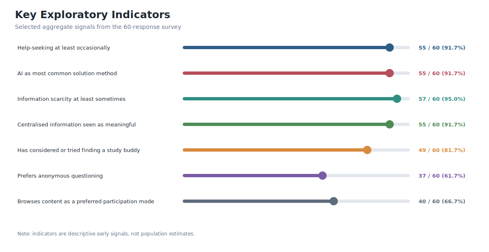
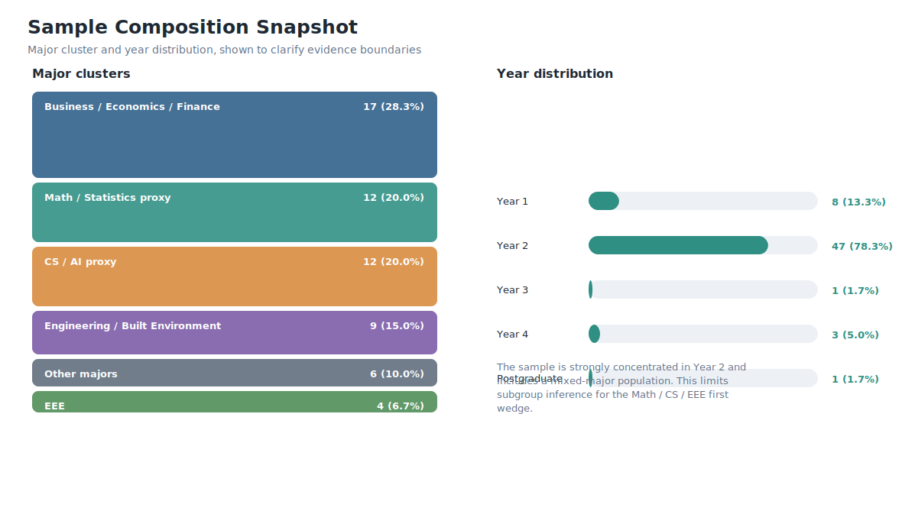
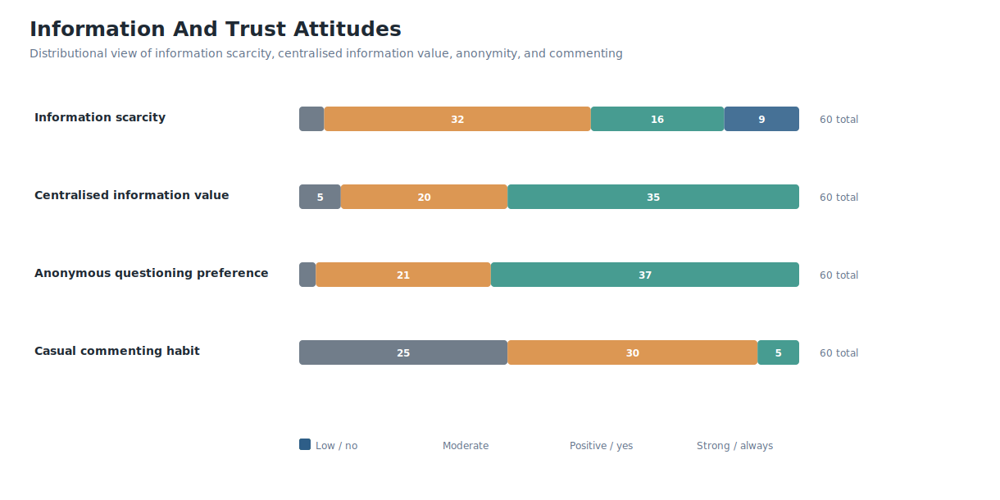
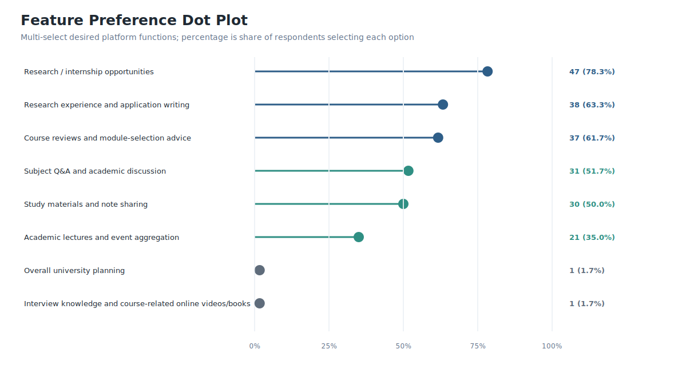
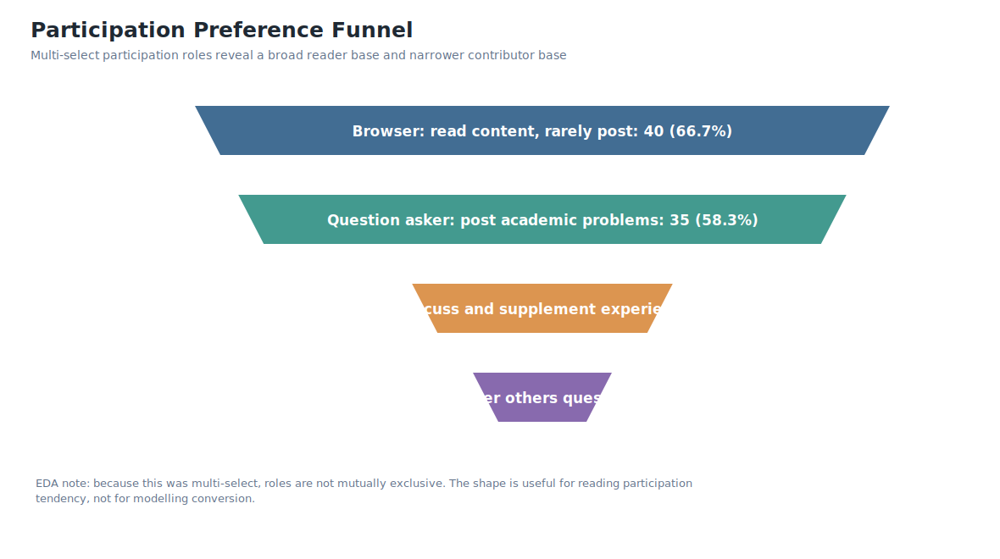
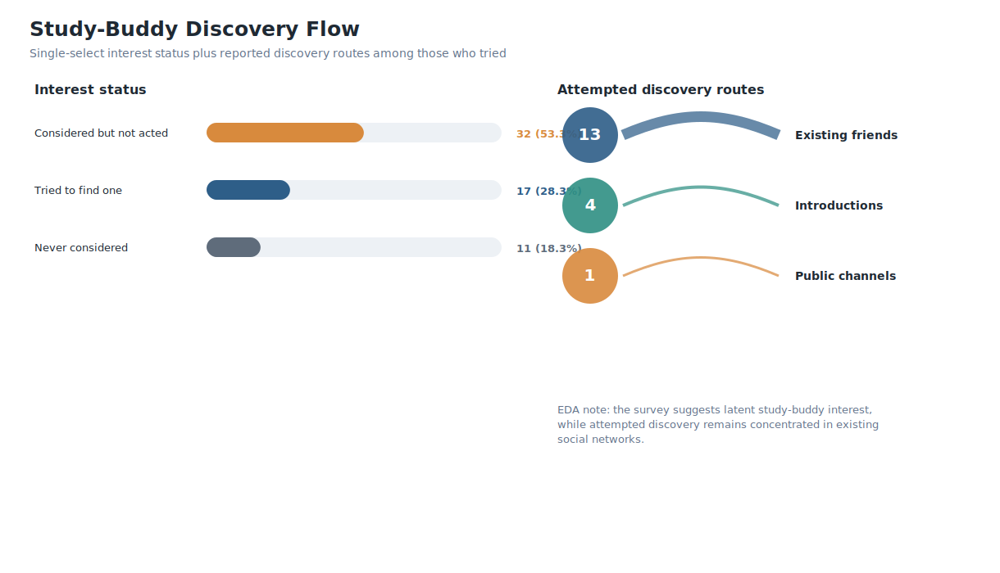
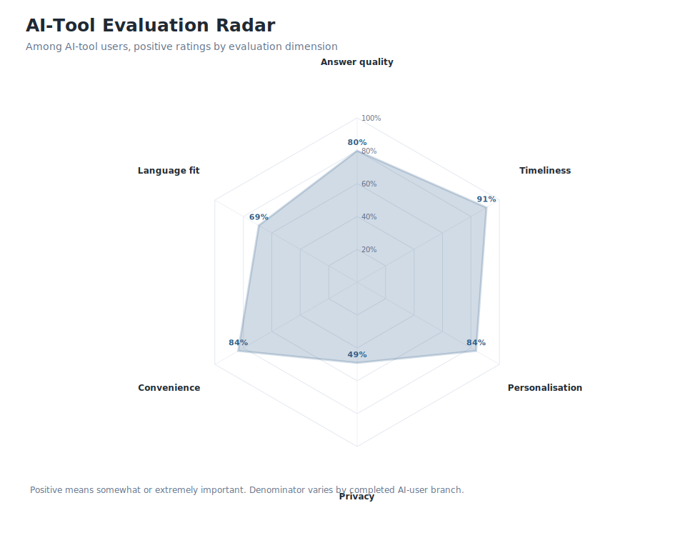

# NeTrix Survey Exploratory Data Analysis

This report summarises the current 60-response academic communication survey through descriptive analysis and visualisation. It is intended to support, but not pre-write, the business plan. The figures provide structured evidence that the Biz team can interpret and incorporate into the BP according to its own narrative decisions.

The dataset should be treated as exploratory discovery evidence. It is useful for identifying patterns, early demand signals, and research directions, but it should not be presented as representative proof of the full UNNC population or the complete Math / CS / EEE first wedge.

## 1. Key Indicators

The strongest aggregate signals are AI-tool reliance, recurring information scarcity, perceived value of centralised information, study-buddy interest, preference for anonymous questioning, and passive browsing tendency.

These indicators are useful for framing the survey's overall direction. They should remain descriptive: the correct claim is that the survey suggests promising early signals, not that it proves adoption.

## 2. Sample Composition

The sample contains 60 responses and is concentrated in Year 2 students. The major distribution is mixed. The dataset includes first-wedge-relevant responses from Math / Statistics, CS / AI, and EEE proxies, but also contains business, economics, finance, engineering, built environment, and other majors.

This composition should be considered when interpreting the results. The survey can support broad problem discovery, but first-wedge validation still requires targeted follow-up with Math, Computer Science, and EEE students.

## 3. Information And Trust Attitudes

The information and trust questions show strong perceived value for centralised information, frequent information scarcity, and a meaningful preference for anonymous questioning. Commenting behaviour is more mixed.

This distributional view is more useful than a single average because it shows where opinions are concentrated and where they remain mixed.

## 4. Feature Preferences

Desired functions are not limited to subject Q&A. Respondents also show strong interest in research or internship opportunities, research experience and application writing, course reviews, module-selection advice, and study materials.

Because this was a multi-select question, the percentages represent the share of respondents selecting each option. They should be read as relative preference signals rather than mutually exclusive choices.

## 5. Participation Preferences

The participation data suggests that many respondents are willing to browse or ask questions, while fewer select commenting or answering as preferred participation roles.

This does not mean users will never contribute. It does suggest that the first platform experience should not assume a naturally high level of active answering or commenting.

## 6. Study-Buddy Discovery

Most respondents have either considered or tried finding a study buddy. Among respondents who tried, existing friends appear to be the dominant route, with broader public channels much less common.

This supports further investigation into academic peer discovery. It does not, by itself, prove that users will send or accept connection requests in the MVP.

## 7. AI-Tool Evaluation

Among respondents in the AI-user branch, timeliness, personalisation, convenience, and answer quality are especially valued. Privacy is more divided than the other dimensions.

The radar chart should be interpreted as a descriptive comparison across dimensions. It should not be used to imply a formal latent construct or a validated psychometric scale.

## 8. Summary Of EDA Findings

The survey suggests several useful directions for business-plan research. AI-assisted learning is already highly visible in the sample. Information scarcity and centralised information demand are strong descriptive signals. Feature preferences are broader than Q&A, which supports a wider academic information and experience-sharing framing. Participation preferences suggest a need to account for passive browsing and content seeding. Study-buddy interest provides a basis for exploring academic connection, but behavioural validation is still required.

## 9. Recommended Next Step

The next research step should be 8 to 12 targeted interviews with Math, Computer Science, and EEE students. Those interviews should clarify which survey patterns are most relevant to the first MVP wedge and which claims should be kept broad, narrowed, or revised before the final business plan.
